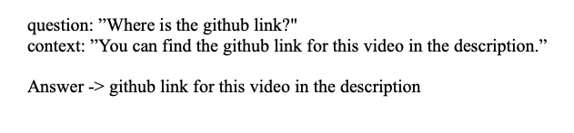
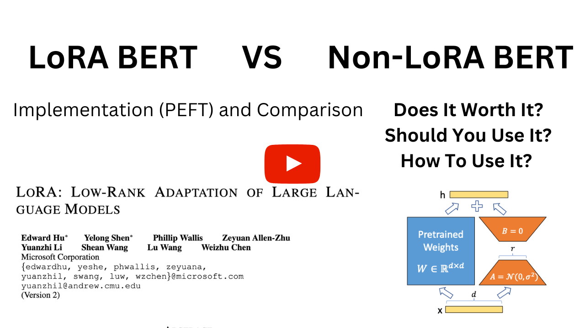

## Fine-Tune BERT For Question Answering



This repository contains an easy-to-use and understand code to fine-tune BERT for Question-Answering(Q&A) with option to use [LoRA](https://github.com/microsoft/LoRA). Sample training was made by using [SQuAD Dataset](https://rajpurkar.github.io/SQuAD-explorer/). Dataset preparation part was inspired from [HuggingFace Tutorial](https://huggingface.co/transformers/v3.2.0/custom_datasets.html#question-answering-with-squad-2-0).

Above example demonstrates a sample context, question and answer. 

### YouTube Tutorial
This repository also contains a corresponding YouTube tutorials. 

To implement the main Q&A code check this video: **Fine-Tune BERT For Question-Answering(Q&A) - PyTorch & HuggingFace**
[](https://www.youtube.com/watch?v=PikqVppe408&t=9s)

To learn more about LoRA, see how it's implemented in this repository and view the experiments check this video: **LoRA BERT vs Non-LoRA BERT: Comparison and Implementation**
[](https://www.youtube.com/watch?v=gHsm1F2muiM&t=8s)

### Project Structure
Project structured as follows:
```
.
└── src/
    ├── squad_dataset.py
    ├── main.py
    ├── inference.py
    ├── data/
    │   └── SQuAD.json
    └── models/
```

`squad_dataset.py` creates the PyTorch dataset. `main.py` file contains the training loop. `inference.py` contains necessary functions to easly run an inference.

`models/` directory is to save and store the trained models.

`data/` directory contains the data you're going to train on in `.json` format.

### LoRA Support
In order to enable the LoRA support you have to set the `LORA` variables in the `main.py` and `inference.py` files to `True` for training and inference respectively. That's it! I used [DEFT](https://huggingface.co/docs/peft/index) to leverage LoRA into the code.

### LoRA BERT vs Non-LoRA BERT
Comparion of LoRA BERT and Non-LoRA BERT by loss values given below.

| # Epoch | Loss Type  | LoRA BERT | Non-LoRA BERT |
|---------|------------|-----------|---------------|
| EPOCH 1 | Train Loss | 3.6272    | 1.7146        |
|         | Val Loss   | 2.5768    | 1.0590        |
| EPOCH 2 | Train Loss | 2.4223    | 0.7724        |
|         | Val Loss   | 1.8951    | 1.0691        |
| EPOCH 3 | Train Loss | 1.9270    | 0.4640        |
|         | Val Loss   | 1.5660    | 1.2105        |

Comparion of LoRA BERT and Non-LoRA BERT by training time and GPU utility given below.
| Metrics              | LoRA BERT       | Non-LoRA BERT   |
|----------------------|-----------------|-----------------|
| GPU Utility          | 10.4GB          | 12.9GB          |
| Training Time        | 3763.52 Seconds | 4597.28 Seconds |
| File Size            | 2.4MB           | 385MB           |
| Inference Latency    | 0.14 Seconds    | 0.14 Seconds    |
| Trainable Parameters | 108893186       | 592900          |

### Pre-Trained Models
You can download sample pre-trained models for [LoRA BERT](https://drive.google.com/file/d/1JfUJnAIupcaEv6PKzVOoB0Lsk1wv_q1Y/view?usp=sharing) and [Non-LoRA BERT](https://drive.google.com/file/d/1aIcI_9RRWVUJHts5ZgsKDuH4HjVFe467/view?usp=sharing). Put the models into the `models/` directory where `inference.py` natively points to. Note that these sample models were trained on 20000 samples of the whole dataset.

### Inference
`inference.py` file provides easy pipeline to use. Change the `context` and `question` variables based on your need. Change the `MODEL_PATH` variable inside the pipeline to point to your trained model. If you want to use the LoRA model change `LORA` variable to `True`.

### Training
In order to train the model you must run the command `python main.py`. File has hyperparameters of `LEARNING_RATE`, `BATCH_SIZE` and `EPOCHS`. You can change them as you like. To use LoRA set `LORA` to `True`.

You must give your data directory, the directory you want to save your model to and your base model to `DATA_PATH` and `MODEL_SAVE_PATH` and `MODEL_PATH`variables in the `main.py` file. By default `bert-base-uncased` selected to serve as the base model.

By the end of the training your model will be saved into the `MODEL_SAVE_PATH`.
